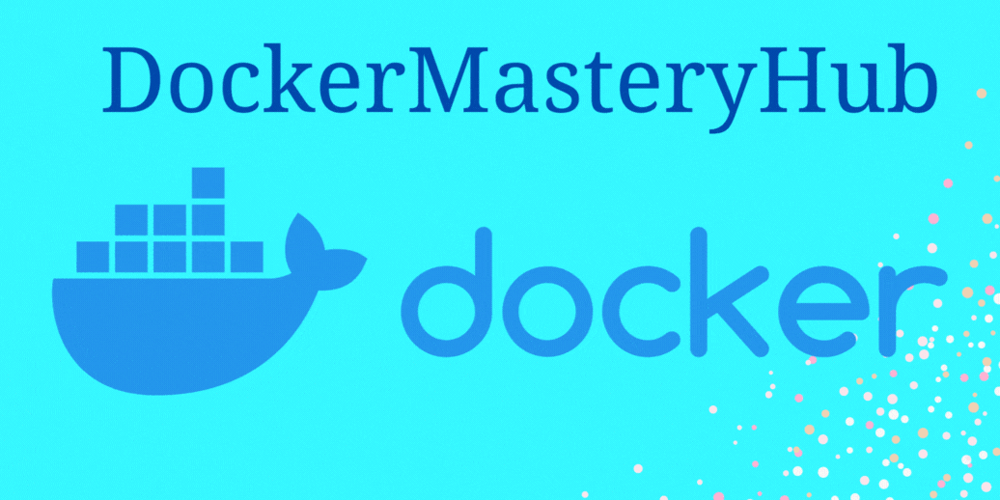

# Docker Mastery Hub

Welcome to the Docker Learning Repository! This repository is designed to guide you through the fundamentals and advanced topics of Docker, helping you gain practical skills in containerization.

## <--- In Progress --->

## Basic Level:

#### [1. Introduction to Docker](./1-Basic/01-Introduction-to-Docker.md)

- 1.1. What & Why of virtualization & containerization?
- 1.2. What is Docker.?
- 1.3. Docker Architecture and components
- 1.4. Docker Workflow

#### [2. Installing Docker](./1-Basic/02_Installing_Docker.md)

- 2.1. Installing Docker (Linux, macOS, Windows)

#### [3. Docker Images](./1-Basic/03_Docker_Images.md)

- Understanding Docker images and containers
- Docker image layers and how they work
- Creating custom Docker images using Dockerfile
- Best practices for writing Dockerfiles
- Managing images with Docker Hub and private registries

#### [4. Writing Dockerfiles and Building Images with Dockerfiles](./1-Basic/04_Writing_Dockerfiles.md)

- 3.1. What & Why is a Dockerfile?
- 3.2. Explanation of key directives such as `FROM`, `RUN`, `COPY`, `ADD`, `CMD`, `ENTRYPOINT`, `ENV` and `WORKDIR`.
- 3.3. Basic syntax and structure of Dockerfiles
- 3.4. Building Docker images using Dockerfiles
- 3.5. Managing Docker Images: `docker images`, `docker tag`, `docker rmi`
- 3.6. Few more directives: `ARG`, `EXPOSE`, `VOLUME`, `EXPOSE`, `LABEL`, `ONBUILD`, `HEALTHCHECK`, `SHELL`, `USER`.

#### [4.5. All different Dockerfiles of different language](./1-Basic/04.5_All_Dockerfiles.md)

#### [4. Running & Managing Docker Containers](./1-Basic/04_Running-Managing-Docker-Containers.md)

- 4.1. Running Docker Containers from Images: `docker run`
- 4.2. Managing Docker Containers: `docker ps`, `docker rm`, `docker logs`, `docker exec`, `docker start/stop/restart`
- 4.3. Viewing Container Information: `docker inspect`, `docker stats`

#### [5. Image Layering & Multi-Stage Builds](./1-Basic/05_Docker-Image-Optimization-Efficiency.md)

- 5.1. Image Layering Concept with Dockerfile
- 5.2. Techniques for Minimizing Image Size
- 5.3. Dockerfile with **Multi-Stage Builds**

#### [6. Docker Hub and Private Registry Management](./1-Basic/06_Docker-Hub-Private-Registry-Management.md)

- 6.1. Introduction to Docker Hub
- 6.2. Pushing and pulling Docker images from Docker Hub
- 6.3. Creating Private Docker Registry and their setup

## Intermediate Level:

#### [1. Docker Volumes](./2-Intermediate/01-Docker-Volumes.md)

- 1.1. Introduction to Docker Volumes
- 1.2. Creating or Mounting Docker Volumes
- 1.3. Managing Docker volumes
- 1.4. Volume Drivers

#### [2. Docker Networking - I](./2-Intermediate/02-Docker-Networking-I.md)

- 2.1 Introduction to Docker Networking
- 2.2 Default Networking in Docker
- 2.3 Docker Bridge Networking
- 2.4 Exposing Ports and Port Mapping

#### [3. Docker Compose](./2-Intermediate/03-Docker-Compose.md)

- 3.1 Introduction to Docker Compose
- 3.2 Docker Compose File Basics
- 3.3 Docker Compose Directives
  - 3.3.1 [Detailed Docker Compose Directives](./2-Intermediate/03-1-Docker-Compose-Directives.md)
- 3.4 Managing multi-container applications with Docker Compose

#### [4. Container Security](./2-Intermediate/04-Container-Security.md)

- 4.1 Security Best Practices for Dockerfiles
- 4.2 Vulnerability Scanning and Image Hardening
- 4.3 Least Privilege Principles
- 4.4 Compliance and Regulatory Requirements

## Advanced Level:

#### Docker Buildx and BuildKit

11. **Kubernetes Basics**

    - Introduction to Kubernetes
    - Kubernetes architecture
    - Deploying applications on Kubernetes

12. **Advanced Docker Networking**

    - Docker overlay networking
    - Service discovery and load balancing with Docker Swarm and Kubernetes
    - Implementing network policies

13. **Continuous Integration and Deployment with Docker**

    - Integrating Docker into CI/CD pipelines
    - Building Docker images in CI/CD workflows
    - Automating deployment with Docker and container orchestration tools

14. **Monitoring and Logging with Docker**

    - Docker container monitoring tools (Prometheus, Grafana)
    - Centralized logging with Docker (ELK stack, Fluentd)
    - Monitoring Docker Swarm and Kubernetes clusters

15. **Advanced Docker Concepts**

    - Docker storage drivers
    - Docker security namespaces and capabilities
    - Using Docker for development environments and testing

---

### x. Docker Networking - II

#### Custom Networking with Docker:

- Introduction to custom network creation in Docker.
- Advantages of custom networks over default bridge networking.
- Creating custom bridge, overlay, and macvlan networks using Docker commands and Docker Compose.

#### Docker Overlay Networking:

- Understanding Docker's overlay network for multi-host communication.
- How overlay networks facilitate communication between containers across multiple Docker hosts.
- Configuring and managing overlay networks for distributed applications.

#### Network Drivers and Plugins:

- Overview of Docker network drivers and plugins.
- Different types of network drivers supported by Docker (bridge, overlay, macvlan, etc.).
- How to extend Docker networking capabilities with third-party plugins.

#### Network Security and Best Practices:

- Implementing network security measures within Docker environments.
- Best practices for securing Docker networks against external threats.
- Techniques for network segmentation and isolation to enhance security.

#### Advanced Networking Concepts:

- Exploring advanced networking concepts such as service discovery, load balancing, and network policies.
- Implementing DNS-based service discovery and load balancing using Docker Swarm and Kubernetes.
- Using network policies to enforce communication rules and access controls within Docker networks.

#### Troubleshooting Docker Networking:

- Common networking issues in Docker environments.
- Techniques for troubleshooting network connectivity problems.
- Tips and tricks for debugging and resolving Docker networking issues effectively.

---

#### x. Dockerfile Optimization

1.  **Performance Optimization Techniques:**

    - Identifying performance bottlenecks in Dockerfile commands and instructions.
    - Techniques for optimizing Dockerfile commands to minimize build times and container startup times.
    - Leveraging caching and parallelization to speed up Docker builds.

2.  **Image Caching and Layer Reuse:**

    - Understanding Docker's image layer caching mechanism and its impact on build performance.
    - Strategies for maximizing layer reuse and minimizing unnecessary rebuilds.
    - Using caching directives effectively to improve Dockerfile performance.

3.  **BuildKit and BuildKit Features:**

    - Introduction to Docker BuildKit as a tool for building Docker images more efficiently.
    - Leveraging BuildKit features such as parallel builds, distributed caching, and build secrets.
    - Practical examples of using BuildKit to optimize Dockerfile builds.

4.  **Profiling and Debugging Dockerfiles:**

    - Techniques for profiling and debugging Dockerfile performance issues.
    - Using tools such as `docker buildx` and `BuildKit` to analyze build logs and identify optimization opportunities.
    - Best practices for optimizing Dockerfiles based on profiling insights.

---

### [6. Project's](./Module-6/)

#### [6.1. One tier Application Project](./Module-6/6.1_One_tier_app)

- [6.1.1. Docker Volume - django-todo-cicd](./Module-6/6.1_One_tier_app/6.1.1_docker_volume_django_todo.md)
- [6.1.2. Docker Volume - Todo App](./Module-6/6.1_One_tier_app/6.1.2_docker_volume_todo.md)

#### [6.2. Two tier Application Project](./Module-6/6.2_two_tier_app)

- [6.2.1. Flask App with MySQL](./Module-6/6.2_Two_tier_app/6.2.1_flask_app_mysql.md)
- [6.2.2. Flask App with MySQL with Docker-compose](./Module-6/6.2_Two_tier_app/6.2.2_flask_app_mysql_with_Docker-compose.md)
- [6.2.3. Multistage Dockerfile - Flask App](./Module-6/6.2_Two_tier_app/6.2.3_Multistage_Dockerfile_Flask_App.md)

#### [6.3. Three tier Application Project](./Module-6/6.3_Three_tier_app/)

---

### Industry Level:

16. **Docker in Production**

    - High availability and scalability with Docker
    - Container orchestration at scale (Kubernetes, Docker Swarm)
    - Blue-green deployments and canary releases with Docker

17. **Infrastructure as Code with Docker**

    - Using Docker in infrastructure automation (Terraform, Ansible)
    - Managing Docker infrastructure with infrastructure-as-code tools

18. **Advanced Kubernetes**

    - Kubernetes advanced networking (Calico, Cilium)
    - Custom resource definitions (CRDs) and operators
    - Kubernetes security best practices

19. **Cloud-Native Development with Docker**

    - Building cloud-native applications with Docker
    - Microservices architecture with Docker containers
    - Serverless computing with Docker containers (Knative)

20. **Docker Enterprise Edition (EE)**

    - Docker EE features and benefits
    - Docker EE installation and configuration
    - Managing Docker EE clusters in production environments
