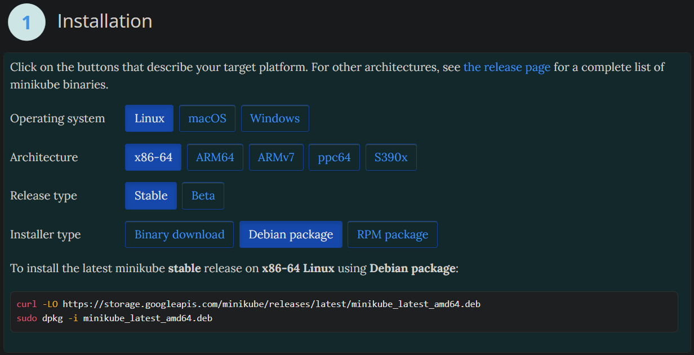

# Set up Kubernetes on local using Minikube - [Link](https://minikube.sigs.k8s.io/docs/)

### < --- In Progress --- >

### System Requirements

1. Host Compatibility:
   - Use a compatible Linux distribution.
2. Resources:
   - Allocate 2GB+ RAM and 2 CPUs machine.
3. Internet connection

### Steps

> In this guide we will be using, Ubuntu

Step 1: Install Minikube
: Visit the [Minikube installation guide](https://minikube.sigs.k8s.io/docs/start/) and follow the instructions for your operating system. Make sure to install a hypervisor like VirtualBox as well.



- To find the architecture use `uname -m` or `arch`
- Execute these lines.
- Minikube is Installed.

Step 2: Start Minikube Cluster
: Open a terminal and run the following command:

```bash
minikube start
```

---

Alternative

https://kind.sigs.k8s.io/
