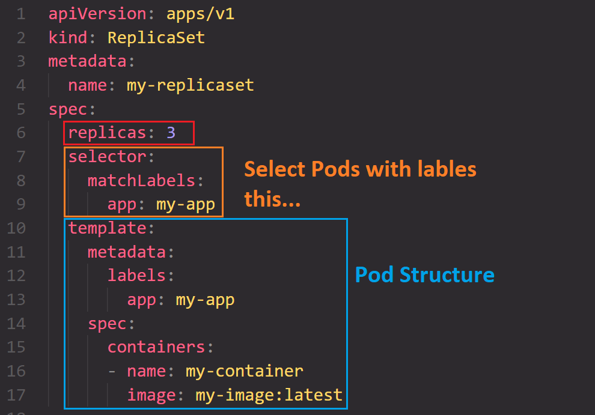
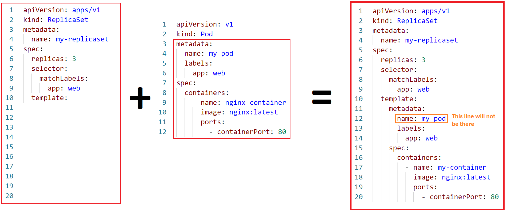

# ReplicaSets

**Official k8s Docs:** https://kubernetes.io/docs/concepts/workloads/controllers/replicaset/

## What are they?

ReplicaSet is a resource or controller that **ensures** a specified number (**desired state**) of <u>replicas of **pods** are always running</u>.

## How do ReplicaSets Work?

Lets Break it down:
: - You declare a manifest file of **`kind: ReplicaSet`**, with a certain number of **`replicas`** (**desired state**).
: - ReplicaSet controller <u>constantly monitors</u> the actual **state** of the pods.
: - If there are lesss replicas that desired state, it creates more.
: - If there are too many, it scales down.

This way, it helps ensure high availability and resilience in your application by automatically managing the number of running instances.

## Why do we need ReplicaSets?

Lets say you have a web app running with multiple Pods. If one of the Pod fails the app will be down this is why we need ReplicaSets. It automatically replace it to match with desired state, keeping web app always running.

- Most of the time ReplicaSets are a part of Deployment.

### ReplicationControllers vs. ReplicaSets

- ReplicationControllers is the **older version** of ReplicaSets.
- ReplicaSets offers set-based selector criteria and label selectors so its better.

---

## Key Components of ReplicaSets:

### Pod Template or `template`:

- It contains the specifications that define how each pod should be created.
- Here are some key elements you might find in a pod template:
  - Container Images
  - Volumes
  - Pod Specifications

### Selector

- **Types of Selectors:-** `matchLabels`, `matchExpressions`
- It help to select Pods with matching lables(like tags).
- In this example, the ReplicaSet is looking for Pods with the label `app: my-app`.

  ```yaml
  selector:
    matchLabels:
      app: my-app
  ```

- labels in the `selector` field match the labels used in the metadata section of the Pod template.

- **`matchExpressions`**: is used for for **complex lable selection** criteria.
- In this example, This selector, looks for Pods with the label environment set to either `production` or `staging`.

```yaml
selector:
  matchExpressions:
    - key: environment
      operator: In
      values:
        - production
        - staging
```

### Replicas

- It represent the desired number of identical pods.
- This number, ReplicaSet, aims to maintain.



- **`template`**: defines the Pod template with a container running the `my-image:latest` image.
- **`selector`**: uses the label `app: my-app` to identify which Pods are part of this ReplicaSet.
- **`replicas`**: is set to `3`, indicating that the desired state is to have three replicas.

---

## Creating ReplicaSet



```yaml
apiVersion: apps/v1
kind: ReplicaSet
metadata:
  name: my-replicaset
spec:
  replicas: 3
  selector:
    matchLabels:
      app: web
  template:
    metadata:
      labels:
        app: web
    spec:
      containers:
        - name: my-container
          image: nginx:latest
          ports:
            - containerPort: 80
```

---

## Some Imp Points

#### Rolling Updates

- When **Pod template** or `template` is changed or modified by user of a ReplicaSet and is applied `kubectl apply -f name.yaml`, Kubernetes starts a rolling update:
- **How K8s dose it?**
  - First it creates new **Pods** with the updated `template`, keeping old ones running.
  - Second it slowly replaces the old Pods with new maintaining the desired number of `replicas`.
  - **Rollback**: If issues arise during the update, you can roll back to the previous version, with this command.
    ```bash
    kubectl rollout undo replicaset my-replicaset
    ```
- Checking Update Progress:

  ```bash
  kubectl get replicaset
  ```

---

## Verification Commands:

### 1. Create a ReplicaSet

```bash
kubectl apply -f your-replicaset-config.yaml
```

### 2. Lists all ReplicaSets in cluster

```bash
kubectl get replicaset
```

### 3. Describe a ReplicaSet:

```bash
kubectl describe replicaset your-replicaset-name
```

---

### Scale a ReplicaSet:

```bash
kubectl scale replicaset your-replicaset-name --replicas=5
```

### Delete a ReplicaSet:

```bash
kubectl delete replicaset your-replicaset-name
```

### Update a ReplicaSet (by applying changes to the config):

```bash
kubectl apply -f your-updated-replicaset-config.yaml
```

### Rolling Restart (Update) a ReplicaSet:

```bash
kubectl rollout restart replicaset your-replicaset-name
```

### Rollback a ReplicaSet Update:

```bash
kubectl rollout undo replicaset your-replicaset-name
```

### View ReplicaSet Pods:

```bash
kubectl get pods --selector=your-label-selector
```

### Exec into a ReplicaSet Pod:

```bash
kubectl exec -it your-pod-name -- /bin/bash
```

---

## Interview Questions
